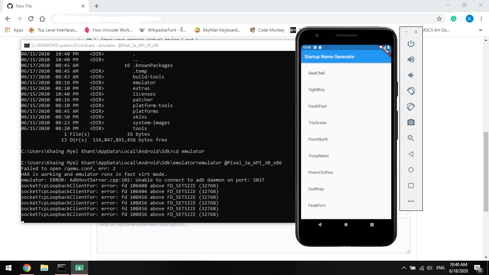

# Launch Android Emulator From Cmd

## Prerequisite

Latest version of Android Sdk need to be installed, <br/>

## 1. Check your android virtual device ( avd ) 
It should be shown something like this
```cmd
C:\Users\Khaing Myel Khant>emulator -list-avds
Pixel_3a_API_30_x86

C:\Users\Khaing Myel Khant>
```

### If you run this default, this error will be shown
```cmd
C:\Users\Khaing Myel Khant>emulator @Pixel_3a_API_30_x86
PANIC: Missing emulator engine program for 'x86' CPU.
```

### What Happended
Actually, the use of emulator command in Android/Sdk/tools/emulator.exe is depreciated and obsolete. <br/>

## Solution
Android Emulator Location is changed from Android/Sdk/tools/emulator.exe to Sdk/emulator/emulator.exe <br/>

We need to use the emulator.exe from Android/Sdk/emulator/emulator.exe <br/>



## Script

I made this [script](https://github.com/kaelkmk/Notes/blob/master/android-emulator-from-cmd/script/launch-emulator.bat) to easier booting of my avd with emulator, enjoy !
